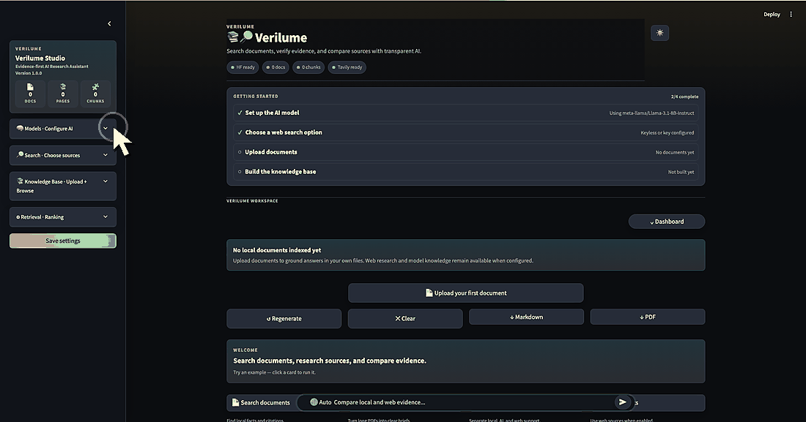
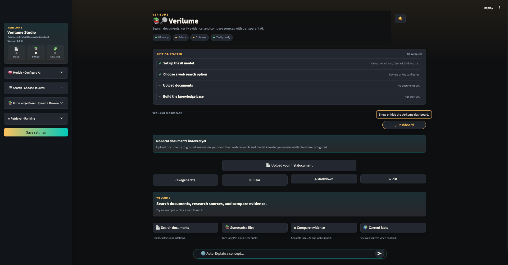
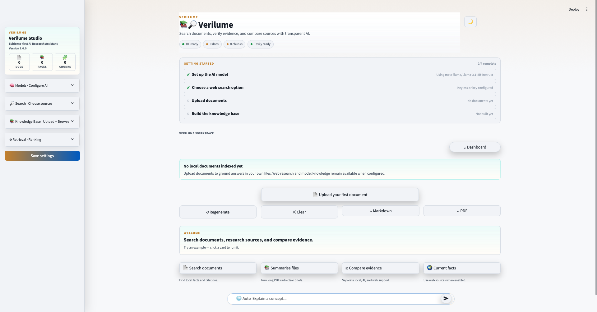
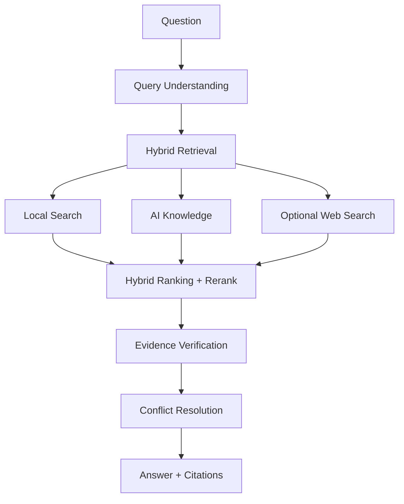

# Verilume

> **Evidence First. Answers Second.**
>
> A local-first, evidence-first AI research assistant. Verilume doesn't just answer questions — it evaluates evidence, verifies claims, calibrates confidence, and shows you exactly why each source won.

<p align="center">
  <a href="#downloads"><strong>Download macOS</strong></a>
  · <a href="#install-from-github">Install from GitHub</a>
  · <a href="#downloads">Windows (Coming Soon)</a>
  · <a href="#documentation">Documentation (Coming Soon)</a>
  · <a href="#about-ecosveri">Website (Coming Soon)</a>
</p>

[](https://github.com/DamingoNdiwa/verilume/actions/workflows/ci.yml)


Most RAG applications answer questions. Verilume **evaluates evidence**: hybrid retrieval (BM25 + embeddings + reranking) over your local documents, optional web search grouped by source authority (government, research, university, news), claim-level verification, calibrated confidence that can never outrank the evidence, and a benchmark mode that compares Local vs AI vs Web vs Full retrieval on any question — all in a privacy-first desktop app.

## Downloads

| Platform | Status |
| --- | --- |
| macOS | Test builds are published on GitHub Releases |
| Windows | Coming Soon |
| Linux | Coming Soon |
| Python package | Install from GitHub while PyPI is pending |

The public EcosVeri release is planned after the repository transfer. Until then, use this GitHub repository for test builds.

## Demo



## Why Verilume?

Modern AI assistants ask you to trust them. Verilume shows its work:

- **Transparent evidence verification** — every answer carries an Evidence Summary: confidence, winning source, agreement, claim support, and *why* the winner won.
- **Calibrated confidence** — the badge is evidence-capped: a freshness conflict caps it to Medium, zero supported claims force it to Low. Fluent prose can't fake certainty.
- **Local-first retrieval with page-level citations** — hybrid BM25 + embeddings + reranking over your own files, cited as `[S1]` with document and page. Nothing is uploaded.
- **Source-quality grouping** — web evidence is grouped and weighted by authority: government, research, university, news, then the open web.
- **Built-in benchmark mode** — compare Local vs AI vs Web vs Full retrieval on any question, with per-mode answers, latency, and faithfulness.
- **A desktop workspace** — manage, index, and query a personal knowledge base with document-aware suggested prompts.

Everything is designed around privacy, transparency and reproducible answers.

## Features

<table>
  <tr>
    <td><strong>Privacy First</strong><br>Runs locally without uploading files.</td>
    <td><strong>Evidence Verification</strong><br>Claim-level support checks, agreement, conflicts, and calibrated confidence on every answer.</td>
    <td><strong>Hybrid Search</strong><br>BM25 + embeddings + reranking over local documents, plus optional authority-grouped web search.</td>
  </tr>
  <tr>
    <td><strong>Benchmark Mode</strong><br>Compare Local vs AI vs Web vs Full retrieval on any question.</td>
    <td><strong>Transparent Citations</strong><br>Page-level local citations and clickable web sources, exportable to Markdown or PDF.</td>
    <td><strong>Desktop Ready</strong><br>Streamlit app with a macOS launcher; Hugging Face today, Ollama-ready. Apache-2.0, built in public.</td>
  </tr>
</table>

## Screenshots

### Dark Mode



### Light Mode



## Architecture



## Why Verilume Is Different

| Feature | Verilume | ChatGPT | NotebookLM |
| --- | --- | --- | --- |
| Local documents | Yes | Partial | Yes |
| Local execution | Yes | No | No |
| Optional web search | Yes | Yes | No |
| Evidence verification | Yes | Partial | Partial |
| Calibrated confidence scoring | Yes | No | No |
| Benchmark across retrieval modes | Yes | No | No |
| Source-authority grouping | Yes | No | No |
| Citations | Yes | Partial | Yes |
| Offline mode | Soon | No | No |

## Citations

Local document citations use `[S1]`, `[S2]`, `[S3]` and show document names plus page metadata when available.

Web citations use `[W1]`, `[W2]`, `[W3]` and are shown separately as clickable sources.

## Roadmap

### Version 1.0

- PDF support
- Word support
- Excel and table-aware retrieval foundations
- OCR
- Hybrid search
- Citations
- Desktop app

### Version 1.1

- Windows builds
- PyPI release
- Better ranking
- Conversation memory polish

### Version 2.0

- Ollama-first local setup
- Vision models
- Local embeddings controls
- Knowledge graphs
- Multi-agent pipeline

### Future

- EcosVeri ecosystem
- ecosveri.dev
- Plugin system
- Cloud sync
- API
- Enterprise edition

## Install

### Desktop

Download the latest `Verilume-macOS-*.zip` from GitHub Releases, unzip it, and open `Verilume.app`.

macOS may show a first-run security warning because test builds are not notarized yet. If that happens, Control-click `Verilume.app`, choose Open, then confirm.

On macOS, you can also double-click the source launcher:

```text
Verilume.command
```

### Install from GitHub

Install the latest committed version from this repository:

```bash
python -m pip install "verilume @ git+https://github.com/DamingoNdiwa/verilume.git@main"
verilume run
```

Install a tagged test release:

```bash
python -m pip install "verilume @ git+https://github.com/DamingoNdiwa/verilume.git@v0.1.0-test.1"
verilume run
```

### CLI

```bash
python -m pip install "verilume @ git+https://github.com/DamingoNdiwa/verilume.git@main"
verilume run
```

PyPI is coming soon. Until then, install from GitHub or run from source.

### Developers

```bash
git clone git@github.com:DamingoNdiwa/verilume.git
cd verilume
python3 -m venv .venv
source .venv/bin/activate
python -m pip install -e ".[dev]"
verilume run
```

Run directly with Streamlit:

```bash
python -m streamlit run src/verilume/app.py
```

## Basic Use

1. Launch the app.
2. Enter a Hugging Face token.
3. Enter a Tavily API key when web search is needed.
4. Select a model.
5. Upload documents.
6. Build the knowledge base.
7. Ask questions.
8. Review local and web citations separately.
9. Export the chat to Markdown or PDF.

## CLI

```bash
verilume run
verilume ingest
verilume stats
verilume config
verilume doctor
```

## Benchmarks

Planned benchmark coverage will compare retrieval and answer quality across:

```text
Question -> Needle -> Needlite -> Verilume
```

Future comparisons will include LangChain, LlamaIndex, Haystack, and NotebookLM-style workflows.

## Documentation

Documentation is being organized around installation, architecture, retrieval, evidence, OCR, and FAQ material.

## About EcosVeri

Verilume is the first project of EcosVeri, an open-source ecosystem focused on trustworthy AI, evidence verification, semantic search, and research tools.

Future EcosVeri projects include:

- Needlite
- VeriSearch
- VeriAgents
- Additional AI developer tools

Website: ecosveri.dev (Coming Soon).

## License

Apache-2.0. See [LICENSE](LICENSE).
