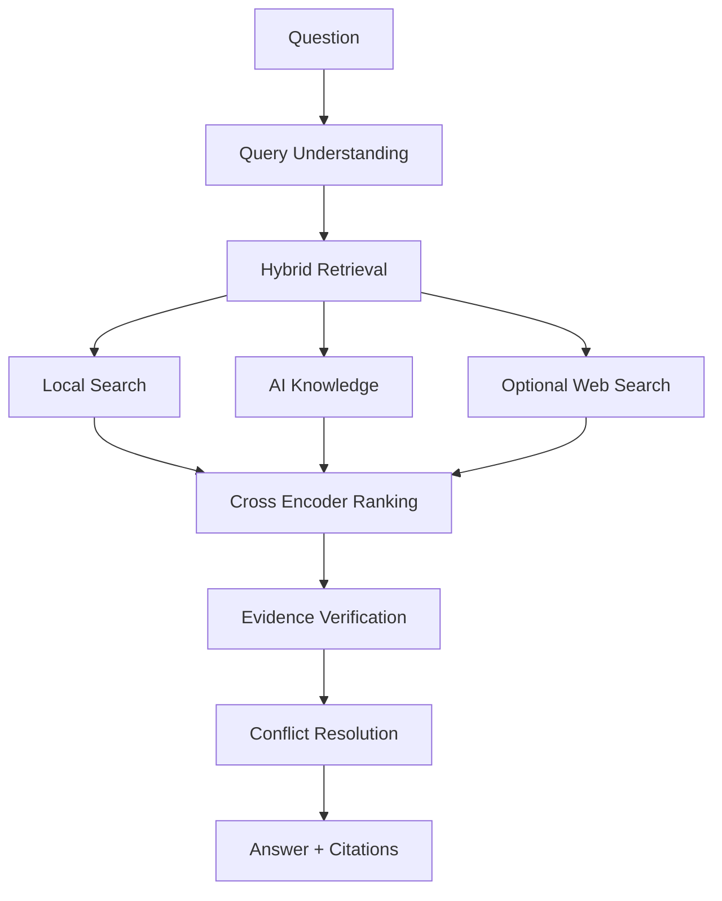

# Verilume

> Privacy-first AI desktop assistant for documents, research and evidence.

<p align="center">
  <a href="#downloads"><strong>Download macOS</strong></a>
  · <a href="#install">PyPI (Coming Soon)</a>
  · <a href="#downloads">Windows (Coming Soon)</a>
  · <a href="#documentation">Documentation (Coming Soon)</a>
  · <a href="#about-ecosveri">Website (Coming Soon)</a>
</p>

[](https://github.com/DamingoNdiwa/verilume/actions/workflows/ci.yml)


Verilume combines local semantic search, AI reasoning, evidence verification, optional web search, and exportable citations in a desktop-ready Python application.

## Downloads

| Platform | Status |
| --- | --- |
| macOS | EcosVeri release planned for July 3, 2026 |
| Windows | Coming Soon |
| Linux | Coming Soon |
| PyPI | Coming Soon |

## Demo

Demo GIF coming soon. The first recording will show PDF upload, indexing, question answering, citation review, and export.

## Why Verilume?

Modern AI assistants often require uploading private documents to cloud services.

Verilume keeps your documents under your control while combining:

- Local semantic search
- AI reasoning
- Evidence verification
- Optional web search
- Source citations

Everything is designed around privacy, transparency and reproducible answers.

## Features

<table>
  <tr>
    <td><strong>Privacy First</strong><br>Runs locally without uploading files.</td>
    <td><strong>Evidence-Based</strong><br>Every answer can include source citations.</td>
    <td><strong>Hybrid Search</strong><br>Local documents plus optional web search.</td>
  </tr>
  <tr>
    <td><strong>Desktop Ready</strong><br>Streamlit app with a macOS launcher and planned release assets.</td>
    <td><strong>Multiple Models</strong><br>Hugging Face today. Ollama-ready local workflows.</td>
    <td><strong>Open Source</strong><br>Apache-2.0 licensed and built in public.</td>
  </tr>
</table>

## Screenshots

### Dark Mode


### Light Mode


## Architecture



## Why Verilume Is Different

| Feature | Verilume | ChatGPT | NotebookLM |
| --- | --- | --- | --- |
| Local documents | Yes | Partial | Yes |
| Local execution | Yes | No | No |
| Optional web search | Yes | Yes | No |
| Evidence verification | Yes | Partial | Partial |
| Citations | Yes | Partial | Yes |
| Offline mode | Soon | No | No |

## Citations

Local document citations use `[S1]`, `[S2]`, `[S3]` and show document names plus page metadata when available.

Web citations use `[W1]`, `[W2]`, `[W3]` and are shown separately as clickable sources.

## Roadmap

### Version 1.0

- PDF support
- Word support
- Excel and table-aware retrieval foundations
- OCR
- Hybrid search
- Citations
- Desktop app

### Version 1.1

- Windows builds
- PyPI release
- Better ranking
- Conversation memory polish

### Version 2.0

- Ollama-first local setup
- Vision models
- Local embeddings controls
- Knowledge graphs
- Multi-agent pipeline

### Future

- EcosVeri ecosystem
- ecosveri.dev
- Plugin system
- Cloud sync
- API
- Enterprise edition

## Install

### Desktop

The macOS desktop release is planned for July 3, 2026 under EcosVeri.

On macOS, you can also double-click the source launcher:

```text
Verilume.command
```

### CLI

```bash
python -m pip install verilume
verilume run
```

PyPI is coming soon. Until then, install from GitHub or run from source.

### Developers

```bash
git clone git@github.com:DamingoNdiwa/verilume.git
cd verilume
python3 -m venv .venv
source .venv/bin/activate
python -m pip install -e ".[dev]"
verilume run
```

Run directly with Streamlit:

```bash
python -m streamlit run src/verilume/app.py
```

## Basic Use

1. Launch the app.
2. Enter a Hugging Face token.
3. Enter a Tavily API key when web search is needed.
4. Select a model.
5. Upload documents.
6. Build the knowledge base.
7. Ask questions.
8. Review local and web citations separately.
9. Export the chat to Markdown or PDF.

## CLI

```bash
verilume run
verilume ingest
verilume stats
verilume config
verilume doctor
```

## Benchmarks

Planned benchmark coverage will compare retrieval and answer quality across:

```text
Question -> Needle -> Needlite -> Verilume
```

Future comparisons will include LangChain, LlamaIndex, Haystack, and NotebookLM-style workflows.

## Documentation

Documentation is being organized around installation, architecture, retrieval, evidence, OCR, and FAQ material.

## About EcosVeri

Verilume is the first project of EcosVeri, an open-source ecosystem focused on trustworthy AI, evidence verification, semantic search, and research tools.

Future EcosVeri projects include:

- Needlite
- VeriSearch
- VeriAgents
- Additional AI developer tools

Website: ecosveri.dev (Coming Soon).

## License

Apache-2.0. See [LICENSE](LICENSE).
