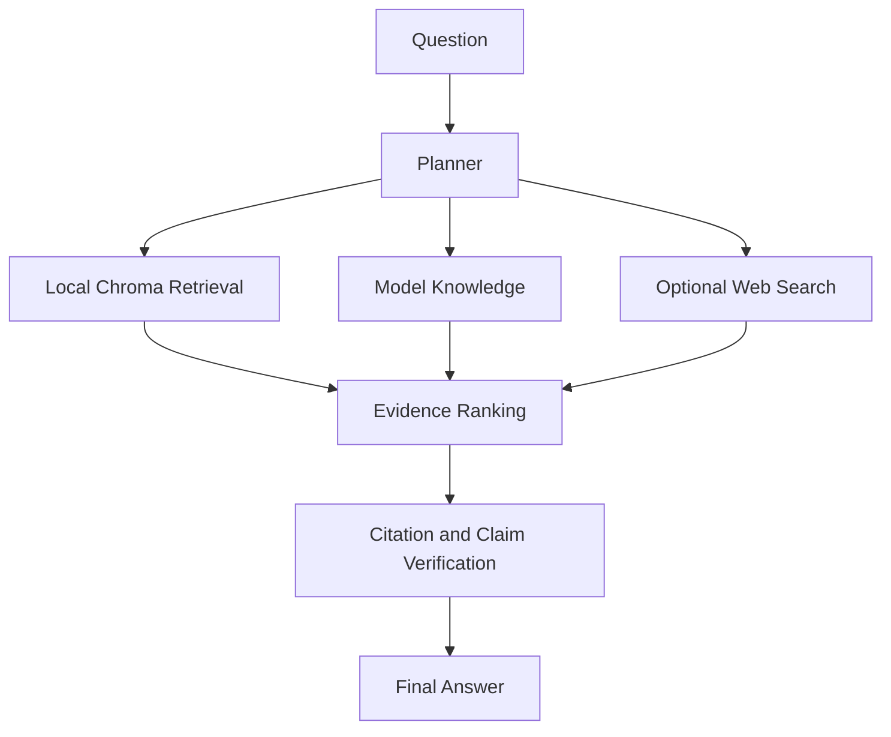

# Verilume

[](https://github.com/DamingoNdiwa/verilume/actions/workflows/ci.yml)

> Local-first AI research assistant with transparent evidence, hybrid retrieval, and source-grounded answers.

Verilume helps users search documents, ask questions, compare evidence, and export cited answers. It combines local document retrieval, AI model knowledge, and optional web search while keeping local files and indexes on the user's machine by default.

## Privacy First

User documents, local indexes, Chroma databases, manifests, tables, semantic cache, and settings stay on the user's computer under `~/.verilume` by default. Verilume does not upload the document library or local vector database.

For a fully local workflow, use Ollama as the generation backend and turn web search off. In that mode, document data stays on the user's computer and is not sent to external model or search providers. Hosted model providers and web search are optional; if enabled, requests are sent only to the services the user configures.

## Why Verilume?

Most local RAG systems retrieve text.

Verilume retrieves, validates, ranks, and explains evidence.

Instead of hiding retrieval, Verilume exposes:

- Evidence ranking
- Confidence
- Local citations
- Web citations
- Hybrid reasoning
- Transparent source selection

Every answer should be explainable.

## What It Does

- Upload and index local documents.
- Search PDFs, scanned PDFs, DOCX, PPTX, TXT, Markdown, CSV, and OCR text.
- Ask questions across local documents, AI knowledge, and optional web sources.
- Show local citations as `[S1]`, `[S2]`, `[S3]`.
- Show web citations as `[W1]`, `[W2]`, `[W3]`.
- Keep local and web sources separate.
- Export chats to Markdown or PDF.
- Run with Hugging Face or Ollama generation backends.

## Architecture

Verilume is a local-first Streamlit application with a Python package backend.

### Main Flow



### Main Components

- `src/verilume/app.py` starts the Streamlit app.
- `src/verilume/ingest.py` extracts, chunks, embeds, and indexes local documents.
- `src/verilume/rag.py` orchestrates local retrieval, model answers, web evidence, ranking, verification, and final synthesis.
- `src/verilume/core/retrieval.py` provides dense, BM25-style, and hybrid Chroma retrieval.
- `src/verilume/core/generation.py` supports Hugging Face and Ollama generation backends.
- `src/verilume/core/web_search.py` supports configurable web search providers.
- `src/verilume/ui/` contains the Streamlit interface.

### Local Data

By default, user data is stored under `~/.verilume`, including uploaded documents, Chroma, ingestion manifests, tables, semantic cache, and local configuration.

## Installation

Verilume can run from source today. A PyPI package and desktop installers are planned release assets.

### From GitHub

```bash
git clone git@github.com:DamingoNdiwa/verilume.git
cd verilume
python3 -m venv .venv
source .venv/bin/activate
python -m pip install -e ".[dev]"
verilume run
```

### With Streamlit

```bash
python -m streamlit run src/verilume/app.py
```

### From PyPI

PyPI installation will be available after the public package release:

```bash
python -m pip install verilume
verilume run
```

### macOS Launcher

On macOS, repository builds can also be launched by double-clicking:

```text
Verilume.command
```

The first launch may download local embedding models. Uploaded documents, Chroma data, and local settings are stored under:

```text
~/.verilume
```

## Basic Use

1. Launch the app.
2. Choose a generation backend.
3. Add a Hugging Face token or use Ollama if configured locally.
4. Optionally add a web search provider key.
5. Upload documents.
6. Build the knowledge base.
7. Ask a question.
8. Review evidence and citations.
9. Export the conversation if needed.

## CLI

```bash
verilume run
verilume ingest
verilume ingest --reset
verilume stats
verilume config
verilume doctor
```

## License

Apache-2.0. See [LICENSE](LICENSE).
