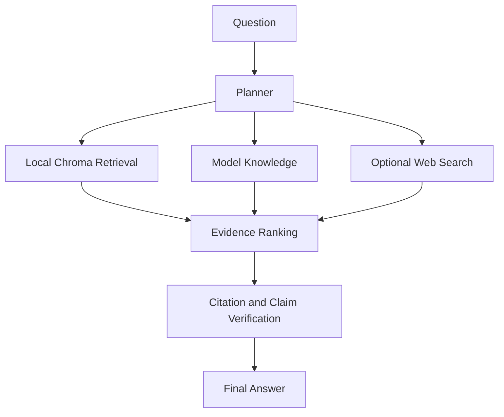

# Verilume

[](https://github.com/DamingoNdiwa/verilume/actions/workflows/ci.yml)

> Local-first AI research assistant for documents, evidence, and source-grounded answers.

Verilume lets users upload documents, build a local knowledge base, ask questions, compare evidence, view citations, and export answers.

## App Preview

Verilume launches straight into the dark research workspace, with model status, local library metrics, source controls, chat actions, and export options visible from the first screen.


Tap the moon/sun appearance toggle in the top-right corner to switch between dark and light previews.


## Privacy

User documents, indexes, Chroma data, manifests, tables, cache, and settings stay on the user's computer under `~/.verilume` by default.

Verilume does not upload the document library or local vector database. For a fully local workflow, use Ollama and turn web search off. Hosted model providers and web search are optional and only used when configured.

## Why Verilume?

Most local RAG apps retrieve text. Verilume retrieves, ranks, verifies, and explains evidence.

It shows:

- local citations `[S1]`, `[S2]`
- web citations `[W1]`, `[W2]`
- confidence and evidence ranking
- local, AI, and optional web source separation

## What It Supports

- PDF, scanned PDF, DOCX, PPTX, TXT, Markdown, CSV, and OCR text
- Chroma local vector database
- Hugging Face and Ollama generation backends
- Optional web search
- Markdown and PDF export

## How It Works



## Install

```bash
git clone git@github.com:DamingoNdiwa/verilume.git
cd verilume
python3 -m venv .venv
source .venv/bin/activate
python -m pip install -e ".[dev]"
verilume run
```

Or run directly with Streamlit:

```bash
python -m streamlit run src/verilume/app.py
```

On macOS, double-click:

```text
Verilume.command
```

## Basic Use

1. Launch the app.
2. Choose Hugging Face or Ollama.
3. Upload documents.
4. Build the knowledge base.
5. Ask questions.
6. Review citations and export the chat.

## CLI

```bash
verilume run
verilume ingest
verilume stats
verilume config
verilume doctor
```

## License

Apache-2.0. See [LICENSE](LICENSE).
