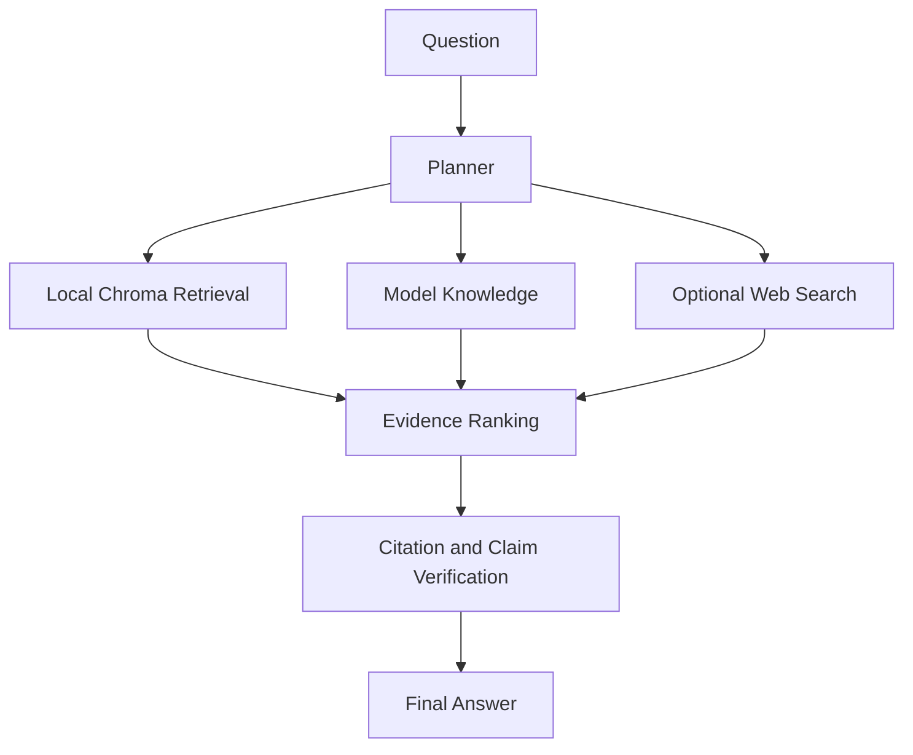

# Architecture

Verilume is a local-first Streamlit application with a Python package backend.

## Main Flow

## Main Components

- `src/verilume/app.py` starts the Streamlit app.
- `src/verilume/ingest.py` extracts, chunks, embeds, and indexes local documents.
- `src/verilume/rag.py` orchestrates local retrieval, model answers, web evidence, ranking, verification, and final synthesis.
- `src/verilume/core/retrieval.py` provides dense, BM25-style, and hybrid Chroma retrieval.
- `src/verilume/core/generation.py` supports Hugging Face and Ollama generation backends.
- `src/verilume/core/web_search.py` supports configurable web search providers.
- `src/verilume/ui/` contains the Streamlit interface.

## Local Data

By default, user data is stored under `~/.verilume`, including uploaded documents, Chroma, ingestion manifests, tables, semantic cache, and local configuration.
